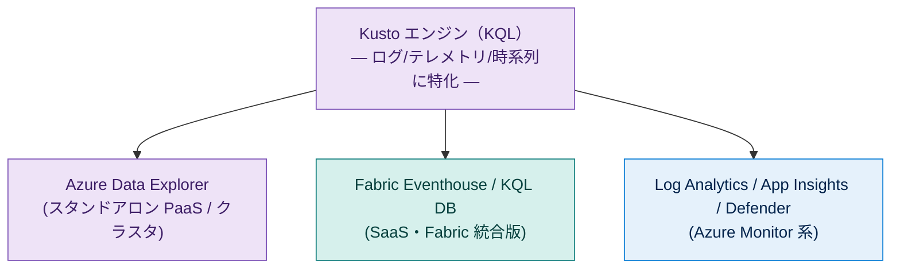
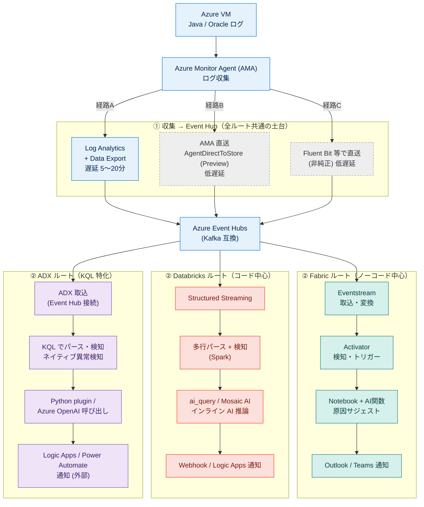
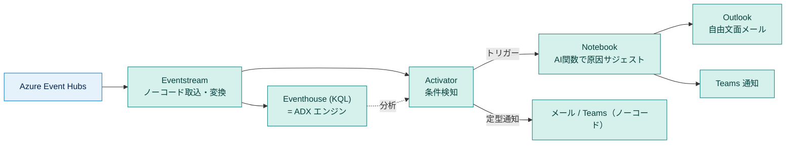
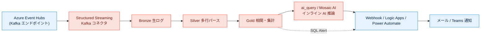
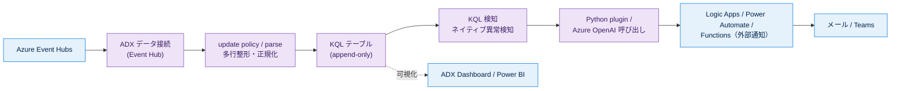
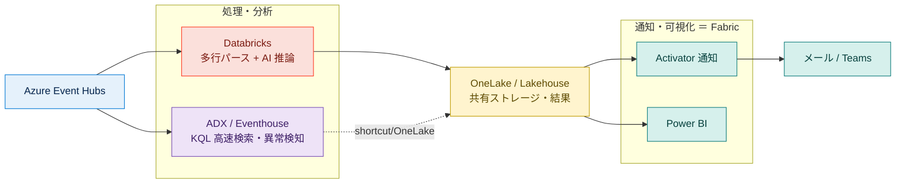
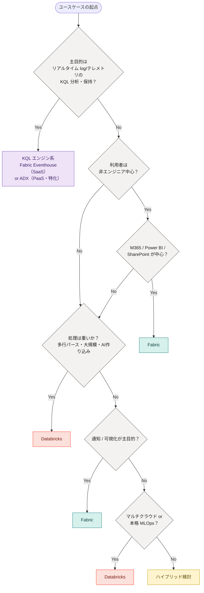

# Microsoft Fabric / Databricks / Azure Data Explorer 比較サマリ

**― データ分析サービス／ログベースのバグ検知・分析基盤の観点から ―**

> **評価時点:** 2026年6月
> **評価対象:** Microsoft Fabric / Databricks / Azure Data Explorer（ADX）
> **評価環境:** Fabric（テナント＋キャパシティ）／ Databricks（Free Edition 中心、一部 Premium 想定）／ ADX（アーキテクチャ観点での追加比較。無料クラスタ／Dev クラスタ前提）
> **注意:** 各サービスとも仕様変更が非常に速い。プレビュー機能や価格は本ドキュメントの評価時点のもの。提案・採用判断の際は公式ドキュメント（付録B）で最新を再確認すること。

---

## ⚠️ 最重要の前提：3者は「対等な競合」ではない

比較に入る前に、誤解しやすい関係を最初に明確にする。

- **Fabric** と **Databricks** は「**取り込み〜処理〜AI〜可視化〜通知まで担う総合プラットフォーム**」。
- **Azure Data Explorer（ADX）** は「**リアルタイムなログ/テレメトリ/時系列に特化した分析エンジン（PaaS）**」。**総合プラットフォームではない**。
- そして重要なのは、**Fabric の Eventhouse / KQL データベースは ADX と同じ Kusto エンジンで動いている**こと。さらに **Log Analytics・Application Insights・Defender も同じ KQL エンジン**。

→ つまり ADX を選ぶか Fabric Eventhouse を選ぶかは、しばしば「**同じエンジンを PaaS（ADX）で持つか、SaaS（Fabric 統合）で持つか**」の選択になる。Microsoft は **ADX → Fabric Eventhouse への移行パス**も公式提供している（付録B）。

---

## TL;DR（4行サマリ）

- **M365 中心・ノーコード・通知/可視化を重視** → **Fabric**
- **コードの自由度・大規模処理・AI/ML の作り込み・マルチクラウド** → **Databricks**
- **大量のログ/テレメトリを KQL で高速に取り込み・検索・時系列分析したいだけ** → **ADX**（または Fabric Eventhouse）。ただし通知・BI・総合ワークフローは外部に頼る
- 今回のログ基盤は3者いずれでも可。**重い処理＝Databricks／KQLでの高速ログ分析＝ADX・Eventhouse／通知・可視化＝Fabric** を組み合わせるのが現実解

---

## 目次

1. [はじめに（凡例つき）](#1-はじめに)
2. [結論サマリ（先出し）](#2-結論サマリ先出し)
3. [比較早見表（3者）](#3-比較早見表3者)
4. [評価軸ごとの詳細比較](#4-評価軸ごとの詳細比較)（4.10 で ADX の位置づけ）
5. [ユースケース：リアルタイムなエラー検知＋AIサジェスト＋通知](#5-ユースケースリアルタイムなエラー検知aiサジェスト通知)
6. [落とし穴・誤解しやすい点（重要訂正まとめ）](#6-落とし穴誤解しやすい点重要訂正まとめ)
7. [まとめ・推奨](#7-まとめ推奨)
8. [ユースケース別 サービス選定チャート](#8-ユースケース別-サービス選定チャート)
- [付録A：用語集](#付録a用語集)
- [付録B：出典・参考リンク](#付録b出典参考リンク)

---

## 1. はじめに

本ドキュメントは、Java アプリケーションログや Oracle alert.log などの**非構造化ログを対象としたバグ検知・分析基盤**を構築するにあたり、Microsoft Fabric / Databricks / Azure Data Explorer のどれを中核（または組み合わせ）に据えるべきかを判断するための比較サマリである。

汎用比較（3〜4章）に加えて、後半（5章）で**具体的なリアルタイム通知ユースケース**を構成図つきで取り上げ、各区間で「できること／できないこと／代替案」を整理する。最後（8章）に、代表的なユースケースごとの選定チャートを示す。

### 凡例

**評価記号:** ◎ = 強い・第一候補／○ = 可能・条件次第で有力／△ = 弱い・要工夫（代替策で補完可）

**構成図（Mermaid）の色分け:**

| 色 | 区分 |
|---|---|
| 青系 | Azure 基盤（VM / AMA / Log Analytics / Event Hub / Logic Apps 等） |
| ティール（緑） | Fabric コンポーネント |
| コーラル（赤） | Databricks コンポーネント |
| 紫 | Kusto / Azure Data Explorer（ADX） |
| 黄 | 共有ストレージ（OneLake 等） |
| 灰・点線 | 任意・非純正・プレビューの経路 |

---

## 2. 結論サマリ（先出し）

- **M365 資産（SharePoint / Outlook / Teams / Power BI）が中心で、ノーコード〜ローコードで通知・可視化まで完結させたい** → **Fabric**。
- **コードファーストで、ストリーミング処理・AI/ML を作り込みたい／マルチクラウドで統一したい** → **Databricks**。
- **大量ログ/テレメトリの高速取り込み・検索・時系列分析（KQL）が主目的で、それ以外（通知・BI）は外部で補ってよい** → **ADX**（または Fabric 内に取り込むなら Eventhouse）。
- **今回のログ分析基盤**（多行ログのパース＋エラー相関＋AIサジェスト＋通知）は3者いずれでも実現可能。分岐点は「ノーコード通知の手厚さ（Fabric）」「処理/AIの自由度（Databricks）」「KQLログ分析への特化と高速性（ADX/Eventhouse）」のどれを重視するか。
- いずれも排他ではなく、**OneLake / Event Hub を介したハイブリッド構成**が現実的（5.6 参照）。

---

## 3. 比較早見表（3者）

| 評価軸 | Fabric | Databricks | Azure Data Explorer（ADX） | 詳細 |
|---|---|---|---|:---:|
| 種別 | 総合 SaaS プラットフォーム | 総合（コード中心）プラットフォーム | ログ/時系列特化エンジン（PaaS） | 4.10 |
| 導入・セットアップ | △ テナント＋キャパシティが手間 | ◎ クラウドアカウントで即時、無料版あり | ○ クラスタ作成（PaaS）。無料/Dev クラスタは即時・安価 | 4.1 |
| 構造化データ取り込み | ◎ CSV/Excel を GUI 取込 | ○ コード中心 | ○ 取込ウィザード/コネクタ（Event Hub/Blob 等）、KQL 前提 | 4.2 |
| 非構造化ログ（多行）取り込み | △ コード（PySpark）必須 | △ コード必須（得意領域） | ○ KQL の update policy / parse で整形可。多行連結は工夫要 | 4.2 |
| 開発体験・UI | ○ 多機能だが分散気味 | ◎ オールインワン（一部設定は CLI/API 専用） | ○ KQL エクスプローラに特化（単機能で分かりやすい） | 4.3 |
| Git 連携 | ○ ワークスペース単位 | ◎ Git folders（任意リポジトリ展開） | △ KQL スキーマは IaC/SyncKusto 等（アイテム同期型ではない） | 4.3 |
| AIアシスタント | ○ Copilot / Data Agent | ◎ Genie / Assistant が強力 | △ KQL 用 Copilot あり。Python plugin・ネイティブ異常検知が強み | 4.4 |
| BI・可視化 | ◎ Power BI 内蔵 | △ 簡易（Power BI 連携推奨） | ○ ADX ダッシュボード＋Power BI(DirectQuery)。BI 単体は簡易 | 4.5 |
| ML / AI 機能 | ○ ネイティブ ML | ◎ Mosaic AI が充実 | ○ Python plugin / Azure ML 連携 / 時系列異常検知が内蔵 | 4.6 |
| 通知・アラート | ◎ Activator/Outlook/Teams | △ 定型は可、自由文面は弱い | △ ネイティブ通知なし → Logic Apps/Power Automate/Functions 等 | 4.7 |
| エコシステム親和性 | ◎ M365 と密 | ◎ マルチクラウド | ○ Azure 特化（Monitor/Sentinel/Defender と同じ KQL） | 4.8 |
| コスト構造 | ○ キャパシティ購入（上限明確） | △ DBU 従量＋クラウド二重課金 | △ クラスタ従量（VM＋markup）。高volumeは割安、無料/Devあり | 4.9 |

---

## 4. 評価軸ごとの詳細比較

### 4.1 導入・セットアップの手間

**Fabric:** Azure 側でのリソースプロバイダー有効化、Fabric キャパシティの構築、M365/テナント側の管理者設定が必要。利用には個人 Microsoft アカウントではなく **Entra（職場/学校）アカウント**が前提。立ち上げまでの初期設定はやや重い。

**Databricks:** AWS / Azure / GCP のいずれかのクラウドアカウントがあれば、リソースを作成するだけで全機能が使える。アカウントが無くても **Databricks 公式の無料版（Free Edition）** が利用可能（2025年に Community Edition を置き換え）。立ち上げは速い。

**ADX:** Azure ポータルからクラスタを作成する PaaS。**無料クラスタ**（Microsoft アカウント or Entra ID で作成、サブスクリプション/クレジットカード不要、1年・自動延長あり、SLA なし）や **Dev/Test（Developer）クラスタ**（単一ノード・markup なし・SLA なし）があり、評価・PoC を低コストで始めやすい。

> **補足:** Databricks Free Edition は**サーバレス専用**。クラシッククラスタは作れない（後述「Standard ティア廃止」とは別の話。6章参照）。ADX の無料/Dev クラスタは機能・容量に制限がある。

### 4.2 データ取り込み（構造化 vs 非構造化）

**構造化データ（CSV/Excel）:**
- **Fabric** … Lakehouse の「Load to Tables」や Dataflow Gen2 の GUI でノーコード取込が可能。**Fabric の明確な強み。**
- **Databricks** … 基本はコード（Auto Loader / COPY INTO 等）。
- **ADX** … 取込ウィザード/コネクタ（Event Hub・IoT Hub・Blob・Kafka 等）で取り込み、KQL でクエリ。ファイル GUI 取込もあるが用途はログ/イベント寄り。

**非構造化ログ（Java スタックトレース、Oracle alert.log のような多行ログ）:**
- **Fabric / Databricks** … 多行のスタックトレースや alert.log のパースは PySpark / Spark SQL による前処理が必要（ノーコードツールでは多行パース不可）。
- **ADX** … 取込時の **update policy** や KQL の `parse` / 正規表現で整形できる。1イベント＝1行前提の設計に強い一方、**複数行を1レコードに連結する処理は取込前の工夫（収集側で連結、または update policy）が要る**。「append-only の大量イベントを高速に取り込み・検索」する用途が本領。

### 4.3 開発体験・UI／Git 連携

**UI:**
- **Fabric** … 体験ごとに画面が切り替わる多機能構成。Copilot ナビあり。
- **Databricks** … 主要機能が1ワークスペースに集約。Assistant/Genie で即解決しやすい。
- **ADX** … KQL クエリエクスプローラに特化した単機能 UI。学習対象が KQL に絞られ、ログ分析の用途では迷いにくい。

**Databricks の運用上の注意（デメリット）― ブラウザ画面（GUI）だけでは完結しない設定がある:**
- **Databricks secrets が代表例。** シークレットスコープの **ACL（権限）管理は CLI / API 専用**で GUI 不可。
- **スコープ作成・シークレット登録**も通常メニューに入口がなく、隠し URL（`#secrets/createScope`）か **CLI / Secrets API** 前提。PoC でも **CLI / `dbutils.secrets` ワークフローが事実上必須**になりやすい（特に Free Edition）。
  *(出典: Databricks Docs / Microsoft Learn — Secret management)*

**Git 連携:**
- **Fabric** … GitHub / Azure DevOps の Git 連携（ワークスペース単位、**Fabric アイテムを同期**するモデル）。
- **Databricks** … **Git folders（旧 Repos）**で任意リポジトリをクローンしフォルダ展開・編集（一般的な開発に近い）。
- **ADX** … KQL のスキーマ/関数は **IaC（ARM/Bicep/Terraform）や SyncKusto・`.show database schema`** でコード管理するのが一般的。アイテム同期型の Git 連携とは性格が異なる。

→ 「Fabric に Git 連携がない」は誤り。**ある。ただし設計思想が Databricks と異なる**、が正確（6章参照）。

### 4.4 AIアシスタント（Copilot / Data Agent / Genie / KQL Copilot）

- **Fabric** … **Copilot**（クエリ生成・操作ナビ）、**Data Agent**（指定データソースの自然言語解析）。プリビルト Azure OpenAI は標準で **F64+/P SKU**、ただし **Copilot capacity（F2+）**を立てれば小さいキャパシティでも利用可（6章参照）。
- **Databricks** … **Genie**（自然言語分析）・**Assistant**（コード支援）が強力。エージェント的な自動生成も可能。
- **ADX** … Web UI に **KQL 記述支援の Copilot** がある。加えて **Python plugin（サンドボックス）**で任意の Python/ML をインライン実行でき、**KQL ネイティブの時系列異常検知**（`series_decompose_anomalies` 等）を標準装備。原因示唆に LLM を使うなら Azure OpenAI を呼び出す実装になる。

### 4.5 BI・可視化

- **Fabric** … **Power BI 内蔵**、Direct Lake で即可視化、M365 共有が容易。**Fabric の強み。**
- **Databricks** … AI/BI Dashboards/Genie はあるが Power BI ほどリッチでない → **Power BI 連携推奨**。
- **ADX** … **ADX ダッシュボード**（KQL ベース）と **Power BI（DirectQuery）/ Grafana** 連携。可視化単体の作り込みは Power BI に寄せるのが定石。

### 4.6 ML / AI 機能

- **Fabric** … ネイティブ Data Science（MLflow/AutoML(FLAML)/モデルレジストリ/PREDICT/AI 関数）。**Azure ML 連携は前提ではない**（6章参照）。
- **Databricks** … Mosaic AI / MLflow（本家）/ Model Serving / Foundation Model API / AutoML。`ai_query` でモデルをコード呼び出し。**中核領域で最も充実。**
- **ADX** … **Python plugin** で scikit-learn 等を使った推論・異常検知、**Azure ML 連携**、**KQL ネイティブの時系列分析/異常検知**。ログ/テレメトリの異常検知に強い。

### 4.7 通知・アラート連携

- **Fabric** … **通知系が手厚い。** Activator のノーコードアラート、Outlook アクティビティで**自由文面メール**、Teams 通知も容易。**明確な強み。**
- **Databricks** … 定型アラート（メール）可。通知先に Email/Webhook/Slack/Teams を設定できるが、**Teams は Webhook 経由**、自由文面メールは弱い。
- **ADX** … **ネイティブの通知/アラート送信機能はない。** 検知は KQL で書けるが、メール/Teams 送信は **Logic Apps / Power Automate / Azure Functions / Grafana アラート**、あるいは **Fabric Eventhouse 化して Activator** に載せる等、外部に頼る。

### 4.8 エコシステム親和性

- **Fabric** … M365 / SharePoint / Teams / Outlook / Power BI と密。
- **Databricks** … AWS / Azure / GCP のマルチクラウド。
- **ADX** … Azure 特化。**Log Analytics / Sentinel / Defender / App Insights と同じ KQL** なので、既存 Azure Monitor 資産との地続き感が強い。

### 4.9 コスト構造

- **Fabric** … **キャパシティ（F SKU）購入**で上限が明確。ただし OneLake ストレージ別課金、AI/Copilot は CU 消費、スムージング（24時間平準化）あり。
- **Databricks** … **DBU 従量課金**。クラシックは「DBU＋クラウド VM」の**二重課金**（サーバレスはインフラ費が DBU 内包）。
- **ADX** … **クラスタ従量（per 分）**。各 VM コスト＋**ADX markup**（PAYG で概ね $0.11/vCore-時 ≒ $80.30/vCore-月、**Dev クラスタは markup 免除**）。ストレージ/ネットワーク別。**高ボリューム取り込み（目安 500GB/日 超）では Log Analytics より割安**になりやすい。停止中はストレージのみ課金。

### 4.10 Azure Data Explorer（ADX）の位置づけ ― 専門エンジンとしての強み・弱み

ADX は「**リアルタイムなログ/テレメトリ/時系列を、KQL で billions レコード規模でも秒で返す**」ことに最適化された専門エンジン。総合プラットフォームの Fabric/Databricks とは土俵が違う。

**強み:**
- **取り込み〜検索の速度とスケール**。append-only の大量イベントに最適化。Event Hub/IoT Hub/Kafka/Blob からネイティブ取込、取込後**数秒**でクエリ可能。
- **KQL 一本**で、フィルタ・集計・`join`・時系列・**ネイティブ異常検知**まで完結。Log Analytics/Sentinel/Defender と同じ言語なので学習・移植が容易。
- **Python plugin** で高度分析を取込／クエリ時にインライン実行可能（Fabric Eventhouse は現状ここが未対応〜制約あり）。
- **無料/Dev クラスタ**で始めやすく、**高ボリュームでは単価が下がる**。

**弱み（＝総合プラットフォームではない）:**
- **通知・BI・複雑な ETL・MLOps を単体で完結できない。** これらは Logic Apps / Power BI / Data Factory / Azure ML 等の**外部サービスと組み合わせる前提**。
- **PaaS のクラスタ運用**（サイズ・スケール・停止/起動・キャッシュ/保持ポリシー）が必要。
- **多行ログの連結**は取込前処理 or update policy の工夫が要る。

**Fabric Eventhouse との選び分け:**
- **同じ Kusto エンジン**。Fabric の中で OneLake/Power BI/Copilot/Notebook/Activator と統合して使いたい → **Eventhouse（SaaS）**。
- スタンドアロンで最大の機能性・Python plugin・細かなクラスタ制御が要る、または既存 ADX 資産がある → **ADX（PaaS）**。
- Microsoft は **ADX → Fabric Eventhouse への段階移行**（クエリ層を先に Fabric へ、データベースショートカットで重複なし）を公式に提供。

---

## 5. ユースケース：リアルタイムなエラー検知＋AIサジェスト＋通知

### 5.1 想定パイプラインと「リアルタイム性」の現実

Azure VM のログを収集し、Event Hub 経由で各プラットフォームに流して、エラー検知 → AI による原因サジェスト → メール/Teams 通知、という一連のパイプラインを想定する。全体像は次のとおり（色は1章の凡例参照）。**Fabric ルートの "Eventhouse" は実体として ADX エンジン**である点に注意。

**「リアルタイム」の定義に注意:**

VM のログを **AMA → Log Analytics → Event Hub** と流す場合、各段に遅延が積み上がる。

- AMA → Log Analytics の取り込み遅延：おおむね **20秒〜3分**。
- Log Analytics → Event Hub（**Data Export 機能**）の遅延：通常 **5〜20分**。**サブ秒のリアルタイム用途には不向き**と公式に明記。
  *(出典: Microsoft Learn — Log Analytics data export)*

→ **「経路A（AMA→LA→Event Hub）」は実質“分単位（最悪20分）の準リアルタイム”**。秒単位が必要なら経路B/C（5.2）を取る。

### 5.2 区間①：VM →（ログ収集）→ Event Hub（全ルート共通の土台）

| 経路 | 収集 | 収集→Event Hub | 合計（目安） | 適する要件 |
|---|---|---|---|---|
| **A** AMA→LA→Data Export | 即時 | LA取込 20秒〜3分 ＋ Export 5〜20分 | **約5〜20分** | 分単位許容＋LAに正本を残す |
| **B** AMA直送（Preview） | 即時 | 数秒〜十数秒 | **数秒〜十数秒** | 低遅延（プレビュー許容） |
| **C** Fluent Bit直送 | 即時 | 数秒 | **数秒** | 低遅延（非純正運用が許容できる） |

- **多行ログの扱い:** AMA のカスタムテキストログ DCR で収集したログは **CLv2** 扱いで **Data Export 対象**。レガシー CLv1（HTTP Data Collector API）は対象外。
  *(出典: Microsoft Learn — Send data to Event Hubs and Storage (Preview) / Log Analytics data export)*

> **設計判断:** 「分単位許容＋LA に正本を残す」→ 経路A。「秒〜十数秒の低遅延」→ 経路B（プレビュー覚悟）か C（非純正）。**まずレイテンシ要件（SLA）を確定**させる。

### 5.3 Fabric での実装（区間②以降）

> Fabric の **Eventhouse は ADX エンジンの SaaS 版**。下図の検知ロジックは KQL で書ける。

- 取り込み〜検知〜通知の大半が**ノーコード（Eventstream + Activator）**で組める。
- **AI サジェストだけコード（Notebook + AI 関数）**に委譲。Activator が「検知 → Notebook 起動 → 通知」のトリガー役。
  *(出典: Microsoft Learn — Eventstreams overview / Activator / Eventhouse)*

### 5.4 Databricks での実装（区間②以降）

- 取り込み〜パース〜検知〜AI 推論まで**一気通貫でコード実装**でき、**AI 推論をストリーム内にインライン**で挟める。
- **弱点は通知の最終段**（自由文面/Teams リッチ通知）→ Logic Apps / Power Automate / Webhook で補完。
- Lakeflow（宣言的パイプライン）は Event Hubs 専用コネクタ不可 → **Kafka エンドポイント経由**。
  *(出典: Databricks Docs / Microsoft Learn — Structured Streaming / Kafka)*

### 5.5 ADX 単体での実装（区間②以降）

- **取り込み・パース・検知（特に時系列異常検知）は KQL で高速かつ簡潔**。Event Hub からネイティブ取込し、秒で検索可能。
- **通知は ADX 単体ではできない**ため、Logic Apps / Power Automate / Functions / Grafana アラートで外部化（または Fabric Eventhouse 化して Activator に載せる）。
- AI サジェストは Python plugin か Azure OpenAI 呼び出しで実装。

### 5.6 区間別「できる／できない／代替案」一覧（3者）

| 区間 | Fabric | Databricks | ADX | 注意点・代替案 |
|---|---|---|---|---|
| VM ログ収集 | AMA（共通） | AMA（共通） | AMA（共通） | CLv2 なら後段 Export 可 |
| LA→Event Hub | Data Export | Data Export | Data Export | 遅延5〜20分 → 代替：AMA直送/Fluent Bit |
| Event Hub 取込 | ◎ Eventstream（ノーコード） | ◎ Kafka コネクタ（コード） | ◎ データ接続（ネイティブ） | 3者とも可 |
| 多行パース | ○ Notebook | ◎ Spark で自在 | ○ update policy/parse（連結は工夫要） | ノーコードでは不可 |
| エラー検知 | ◎ Activator/KQL | ◎ コード/SQL Alert | ◎ KQL＋ネイティブ異常検知 | ADX/Eventhouse は時系列検知が得意 |
| AIサジェスト | ○ Notebook へ委譲 | ◎ インライン（ai_query） | ○ Python plugin / Azure OpenAI | Databricks が最も一体的 |
| メール（自由文面） | ◎ Outlook アクティビティ | △ 弱い | △ ネイティブ不可 | DBX/ADX は Logic Apps 等で補完 |
| Teams 通知 | ◎ コネクタで容易 | △ Webhook 経由 | △ 外部（Logic Apps 等） | Fabric が最も容易 |
| 可視化 | ◎ Power BI 内蔵 | △ Power BI 連携 | ○ ADX Dashboard/Power BI | Fabric が一気通貫 |

### 5.7 ハイブリッド構成という選択肢

「**重い処理＝Databricks／高速ログ分析＝ADX・Eventhouse／通知・可視化＝Fabric**」と役割分担するのが現実解。

- 共通の **Event Hub** を起点に、コンシューマーグループを分けて並列配信。
- **Databricks で重いパース/AI、ADX(またはEventhouse)で高速ログ検索/異常検知、Fabric で通知・可視化** という三者分担も成立する。

---

## 6. 落とし穴・誤解しやすい点（重要訂正まとめ）

1. **「Fabric に GitHub 連携がない」→ 誤り。** GitHub/Azure DevOps の Git 連携あり（Fabric アイテム同期型。Databricks の Git folders とは設計が違う）。

2. **「Fabric の ML は Azure ML 連携が前提」→ 誤り。** ネイティブで MLflow/AutoML/AI 関数を内蔵。Azure ML は任意の連携先。

3. **「Fabric Data Agent は F64（≒100万/月）が無いと使えない」→ 桁感は正しいが不正確。** Copilot capacity（F2+）で小キャパシティでも利用可。

4. **「Databricks は standard が選べずサーバレスのみ」→ 2概念の混同。**（a）Standard“ティア”廃止＝価格ティアの話（2026/4 新規ブロック→2026/10 自動 Premium 化）。（b）サーバレスのみ＝Free Edition の挙動。Premium ではクラシッククラスタ作成可。

5. **「AMA→LA→Event Hub＝リアルタイム」→ 不正確。** Data Export の遅延（5〜20分）が支配的で実態は準リアルタイム。秒単位は AMA 直送/Fluent Bit。

6. **「ADX と Fabric Eventhouse は別物の競合」→ 半分誤り。** **同じ Kusto エンジン**で、PaaS（ADX）か SaaS/Fabric 統合（Eventhouse）かの違い。ADX→Eventhouse 移行パスも公式提供。

7. **「ADX があればログ基盤が完結する」→ 誤り。** ADX は分析エンジンで、**通知・BI・複雑 ETL・MLOps は外部サービス前提**。

---

## 7. まとめ・推奨

- **今回のログ分析基盤は、Fabric / Databricks / ADX いずれでも実現可能。** 本質的な「できないこと」はなく、各段で得手不得手と代替策がある。
- **最大の設計論点はレイテンシ要件。** 「AMA→LA→Event Hub」は分単位。秒単位は AMA 直送（プレビュー）/ Fluent Bit。**まず SLA を確定**。
- **Fabric 中核:** 取り込み〜検知〜通知をノーコード中心、AI サジェストのみ Notebook 委譲。通知・可視化が効く。
- **Databricks 中核:** 取り込み〜パース〜検知〜AI 推論を一気通貫コード。インライン AI が効く。通知は外部補完。
- **ADX 中核:** 大量ログの KQL 高速検索・時系列異常検知に最適。通知・BI は外部 or Eventhouse 化。
- **推奨（折衷）:** 重い処理＝Databricks／KQL高速分析＝ADX・Eventhouse／通知・可視化＝Fabric のハイブリッド。共有は OneLake / Event Hub。

> **次アクション案:** ① レイテンシ要件（秒/分）の確定 → ② 収集経路（A/B/C）の選定 → ③ 検知方式（KQL 異常検知 vs Spark vs Activator）と AI 実装（インライン vs 委譲）の決定 → ④ ADX かFabric Eventhouse か（PaaS/SaaS）の選定 → ⑤ 小規模 PoC で1経路を実測。

---

## 8. ユースケース別 サービス選定チャート

### 選定の早見フロー

### ユースケース別 選定表

| # | ユースケース | 推奨 | 主な理由 |
|:---:|---|:---:|---|
| 1 | リアルタイムデータ処理 | **分岐** | 低コードでイベント駆動・通知中心なら Fabric、重い変換/インラインAIなら Databricks、KQL での高速ログ/時系列なら ADX・Eventhouse（★1） |
| 2 | 初めてデータ分析を行う | **分岐** | 非エンジニア・可視化重視は Fabric、コード/Spark 学習は Databricks Free Edition、KQL でログ探索は ADX 無料クラスタ（★2） |
| 3 | SharePoint Online のファイルを使いたい | **Fabric ◎** | ネイティブコネクタでテーブル化→Power BI まで一気通貫。Databricks/ADX は Graph API 等の作り込みが必要 |
| 4 | アラートをメール / Teams 通知したい | **Fabric ◎** | Activator/Outlook/Teams が容易。Databricks/ADX は Logic Apps/Webhook 補完が要る |
| 5 | エラー検知→GitHub内容で原因調査→issue起票 | **Databricks ◎**（検知前段は Fabric/ADX 可） | リポジトリをコンテキスト化した AI 調査＋GitHub REST 起票はコードファーストの Databricks が自然（★3） |
| 6 | Power BI で社内公開 | **Fabric ◎** | Power BI ネイティブ・Direct Lake・M365 共有。ADX/Databricks も連携可だが Fabric が一気通貫 |
| 7 | 多行ログの大規模パース＋相関分析 | **Databricks ◎** | Spark でのパース/相関の自由度が最大。※基盤の中核処理 |
| 8 | 大量ログ/テレメトリを高速取込・検索・保持（KQL） | **ADX ◎**（Fabric Eventhouse も可） | append-only 大量イベントに最適化、秒で検索、ネイティブ異常検知。高volumeで割安（★4） |
| 9 | マルチクラウド / ベンダー中立 | **Databricks ◎** | AWS/Azure/GCP で同一体験 |
| 10 | 本格 AI/ML 開発・運用（MLOps） | **Databricks ◎** | Mosaic AI/Model Serving/MLflow が充実 |
| 11 | コスト上限を固定して予算管理 | **Fabric ○** | キャパシティ購入で上限明確（ADX/DBX は従量で変動。ADX は停止で圧縮可） |
| 12 | 業務部門がノーコードで自走（市民開発） | **Fabric ◎** | GUI 取込・Activator・Power BI で完結 |
| 13 | 自然言語でデータに質問（業務ユーザー） | **分岐** | Genie なら Databricks、M365/Power BI 連携なら Fabric Data Agent |
| 14 | 大規模 ETL / データエンジニアリング | **Databricks ◎** | Spark 分散処理・Lakeflow が強力 |
| 15 | 既存 Azure Monitor / Log Analytics 資産活用 | **ADX ○ / Fabric ○** | 同じ KQL で地続き。Eventhouse 化や ADX で延長分析。Event Hub 経由なら Databricks でも可 |

### 補足（分岐するユースケースの判断軸）

**★1 リアルタイムデータ処理:** ノーコードで通知/可視化中心＝Fabric ／ 複雑変換・インライン AI・大規模＝Databricks ／ KQL での高速ログ・時系列・異常検知＝ADX or Eventhouse。

**★2 初めてデータ分析:** 非エンジニア・可視化＝Fabric ／ コード/Spark/ML 学習＝Databricks Free Edition ／ ログを KQL で素早く探索＝ADX 無料クラスタ（サブスク/CC 不要）。

**★3 エラー検知→GitHub原因調査→issue起票:** ① Git folders でリポジトリをコンテキスト化、② Vector Search/RAG＋`ai_query` で原因推論、③ ジョブから GitHub REST で起票――の一気通貫が Databricks で自然。検知前段は Fabric Activator や ADX 異常検知に分担可。PAT 等は secrets 管理（Databricks は CLI/API 前提、4.3）。

**★4 ADX か Fabric Eventhouse か:** 同一 Kusto エンジン。Fabric 統合（OneLake/Power BI/Copilot/Activator）重視＝Eventhouse（SaaS）／ スタンドアロン最大機能・Python plugin・細かなクラスタ制御・既存 ADX 資産＝ADX（PaaS）。移行は ADX→Eventhouse の公式パスあり。

### この章の要約

- **M365 親和・ノーコード・通知/可視化・予算固定** → **Fabric**（#3,4,6,11,12 ほか）。
- **コードの自由度・AI/ML・大規模処理・マルチクラウド・開発者ワークフロー** → **Databricks**（#5,7,9,10,14 ほか）。
- **大量ログ/テレメトリの KQL 高速分析・時系列異常検知** → **ADX**（または Fabric Eventhouse）（#8,15 ほか）。
- **一長一短のケースは役割分担のハイブリッド**（処理=DBX／KQL分析=ADX・Eventhouse／通知・可視化=Fabric、共有=OneLake/Event Hub）が現実解。

---

## 付録A：用語集

| 用語 | 説明 |
|---|---|
| **AMA**（Azure Monitor Agent） | Azure VM/Arc からログ・メトリクスを収集。収集定義は DCR。 |
| **DCR**（Data Collection Rule） | 「何を・どこへ」収集するかの定義。宛先は通常 Log Analytics。プレビューで Event Hub/Storage 直送も可。 |
| **CLv2** | DCR ベースのカスタムテキストログ。Data Export 対象（旧 CLv1 は対象外）。 |
| **Log Analytics** | Azure Monitor のログストア（Kusto エンジン）。KQL でクエリ。Data Export で Event Hub/Storage へ（遅延5〜20分）。 |
| **Event Hub** | Azure のイベントストリーミング基盤。Kafka 互換。3者とも購読可能。 |
| **OneLake** | Fabric 共有データレイク（Delta/Parquet）。Databricks/ADX とも連携でき、ハイブリッドの共有層。 |
| **CU**（Capacity Unit） | Fabric キャパシティ（F SKU）の計算単位。スムージング（24h平準化）あり。 |
| **DBU**（Databricks Unit） | Databricks の従量課金単位。コンピュート種別で単価が異なる。 |
| **KQL**（Kusto Query Language） | ログ/時系列向けクエリ言語。ADX・Log Analytics・Eventhouse・Sentinel・Defender 共通。 |
| **Kusto エンジン** | ADX の基盤エンジン。Fabric Eventhouse・Log Analytics も同エンジン。 |
| **ADX**（Azure Data Explorer） | Kusto エンジンのスタンドアロン PaaS。ログ/テレメトリ/時系列特化。クラスタ従量課金、無料/Dev クラスタあり。 |
| **Eventhouse / KQL DB** | Fabric Real-Time Intelligence の KQL ストア（＝ADX の SaaS 版）。OneLake/Power BI/Activator と統合。 |
| **update policy**（ADX） | ADX 取込時に変換・整形・派生テーブル生成を行うルール。多行整形等に利用。 |
| **Python plugin**（ADX） | KQL 内で Python をサンドボックス実行。ML/異常検知/カスタム計算。Eventhouse は現状制約あり。 |
| **Eventstream** | Fabric のノーコード取込・変換・ルーティング。Event Hub 等を源泉にできる。 |
| **Activator**（Data Activator） | Fabric のノーコード検知・トリガー。メール/Teams 通知や Fabric アイテム起動。 |
| **Direct Lake** | Power BI が OneLake の Delta を直接読む高速モード。 |
| **Copilot / Data Agent**（Fabric） | 生成AI。プリビルト Azure OpenAI は F64+/P SKU か Copilot capacity（F2+）が前提。 |
| **Genie / Assistant / Mosaic AI**（Databricks） | 自然言語分析・コード支援・AI/ML スイート。 |
| **`ai_query()`** | Databricks SQL/PySpark からモデルを呼ぶ組み込み関数。ストリーム内インライン推論に使える。 |
| **Medallion**（Bronze/Silver/Gold） | 生→整形→集計の3層データ設計。 |
| **Structured Streaming / Lakeflow** | Spark のストリーム処理／宣言的 ETL（Event Hub は Kafka エンドポイント経由）。 |
| **Git folders（旧 Repos）** | Databricks の Git 連携。任意リポジトリをフォルダ展開・編集。 |

---

## 付録B：出典・参考リンク

> いずれも評価時点（2026年6月）に参照。仕様・価格は変わり得るため、採用判断時は最新版を確認すること。

**AMA / Log Analytics / Event Hub（収集経路）**
- Send data to Event Hubs and Storage (Preview)：https://learn.microsoft.com/azure/azure-monitor/agents/azure-monitor-agent-send-data-to-event-hubs-and-storage
- Log Analytics data export：https://learn.microsoft.com/azure/azure-monitor/logs/logs-data-export

**Fabric（取り込み・AI・ML・Git・リアルタイム）**
- Fabric Data agent の概要・前提：https://learn.microsoft.com/fabric/data-science/concept-data-agent
- Fabric Copilot capacity：https://learn.microsoft.com/fabric/admin/fabric-copilot-capacity
- Git integration：https://learn.microsoft.com/fabric/cicd/git-integration/intro-to-git-integration
- Eventhouse overview：https://learn.microsoft.com/fabric/real-time-intelligence/eventhouse
- Eventstreams overview / Activator：https://learn.microsoft.com/fabric/real-time-intelligence/event-streams/overview

**Azure Data Explorer（ADX）**
- ADX 価格（クラスタ/markup）：https://azure.microsoft.com/pricing/details/data-explorer/
- ADX 無料クラスタ：https://learn.microsoft.com/azure/data-explorer/start-for-free
- ADX cost per GB ingested（コスト要因）：https://learn.microsoft.com/azure/data-explorer/pricing-cost-drivers
- ADX → Fabric Eventhouse 移行：https://learn.microsoft.com/fabric/real-time-intelligence/migrate-azure-data-explorer

**Databricks（ストリーミング・AI・通知・secrets・ティア）**
- Structured Streaming（Kafka / Event Hubs）：https://learn.microsoft.com/azure/databricks/structured-streaming/
- `ai_query`（AI Functions）：https://learn.microsoft.com/azure/databricks/large-language-models/ai-query
- Secret management（CLI/API 前提）：https://learn.microsoft.com/azure/databricks/security/secrets/
- Azure Databricks 価格（ティア）：https://azure.microsoft.com/pricing/details/databricks/

*※ URL は評価時点のもの。リンク切れの可能性があるため、各社ドキュメントサイト内検索での確認を推奨。*
