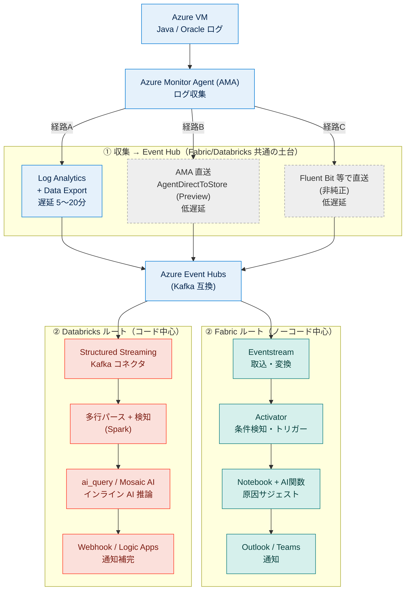
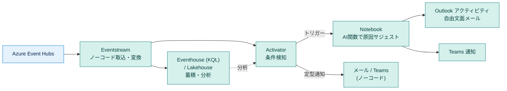
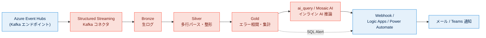
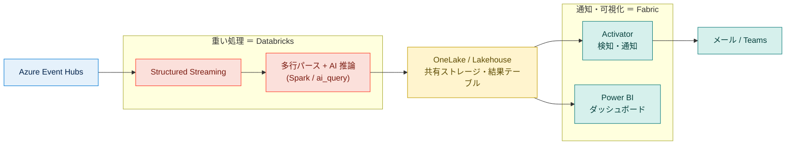
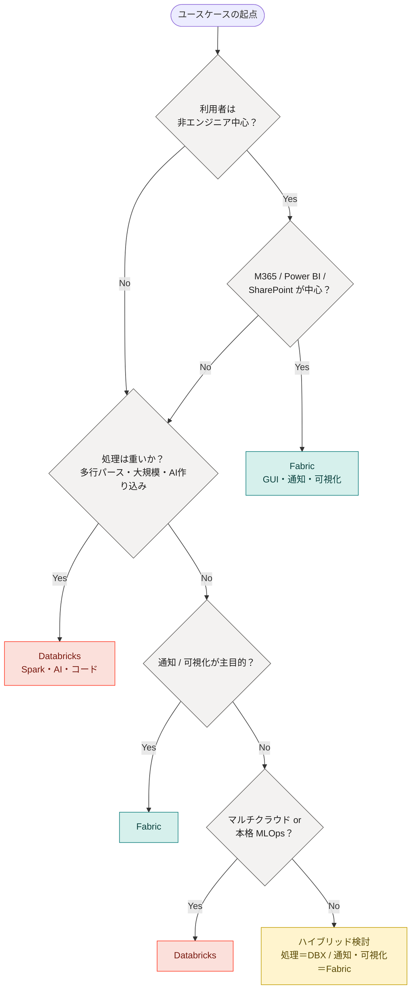

# Microsoft Fabric と Databricks 比較サマリ

**― データ分析サービス／ログベースのバグ検知・分析基盤の観点から ―**

> **評価時点:** 2026年6月
> **評価対象:** Microsoft Fabric / Databricks（データ取り込み・処理・AI・通知・コストの各観点）
> **評価環境:** Fabric（テナント＋キャパシティ環境）／ Databricks（Free Edition を中心に検証、一部 Premium 想定）
> **注意:** 両サービスとも仕様変更が非常に速い。プレビュー機能や価格は本ドキュメントの評価時点のもの。提案・採用判断の際は公式ドキュメント（付録B）で最新を再確認すること。

---

## TL;DR（3行サマリ）

- **M365 中心・ノーコード・通知/可視化を重視** するなら → **Fabric**
- **コードの自由度・大規模処理・AI/ML の作り込み・マルチクラウド** を重視するなら → **Databricks**
- 今回のログ分析基盤は **どちらでも実現可能**。最大の論点は「“リアルタイム”は経路次第で実質“分単位”になる」こと。**重い処理＝Databricks／通知・可視化＝Fabric のハイブリッド**が有力解。

---

## 目次

1. [はじめに（凡例つき）](#1-はじめに)
2. [結論サマリ（先出し）](#2-結論サマリ先出し)
3. [比較早見表](#3-比較早見表)
4. [評価軸ごとの詳細比較](#4-評価軸ごとの詳細比較)
5. [ユースケース：リアルタイムなエラー検知＋AIサジェスト＋通知](#5-ユースケースリアルタイムなエラー検知aiサジェスト通知)
6. [落とし穴・誤解しやすい点（重要訂正まとめ）](#6-落とし穴誤解しやすい点重要訂正まとめ)
7. [まとめ・推奨](#7-まとめ推奨)
8. [ユースケース別 サービス選定チャート](#8-ユースケース別-サービス選定チャート)
- [付録A：用語集](#付録a用語集)
- [付録B：出典・参考リンク](#付録b出典参考リンク)

---

## 1. はじめに

本ドキュメントは、Java アプリケーションログや Oracle alert.log などの**非構造化ログを対象としたバグ検知・分析基盤**を構築するにあたり、Microsoft Fabric と Databricks のどちらを中核に据えるべきかを判断するための比較サマリである。

汎用的なデータ分析プラットフォーム比較（3〜4章）に加えて、後半（5章）で**具体的なリアルタイム通知ユースケース**を構成図つきで取り上げ、各区間で「できること／できないこと／代替案」を整理する。最後（8章）に、代表的なユースケースごとの選定チャートを示す。

### 凡例

**評価記号:**

| 記号 | 意味 |
|:---:|---|
| ◎ | 強い・第一候補 |
| ○ | 可能・条件次第で有力 |
| △ | 弱い・要工夫（代替策で補完可） |

**構成図（Mermaid）の色分け:**

| 色 | 区分 |
|---|---|
| 青系 | Azure 基盤（VM / AMA / Log Analytics / Event Hub / Logic Apps 等） |
| ティール（緑） | Fabric コンポーネント |
| コーラル（赤） | Databricks コンポーネント |
| 黄 | 共有ストレージ（OneLake 等） |
| 灰・点線 | 任意・非純正・プレビューの経路 |

---

## 2. 結論サマリ（先出し）

- **M365 資産（SharePoint / Outlook / Teams / Power BI）が中心で、ノーコード〜ローコードで通知・可視化まで完結させたい** → **Fabric** が有利。
- **コードファーストで、ストリーミング処理・AI/ML を作り込みたい／マルチクラウドで統一したい** → **Databricks** が有利。
- **今回のログ分析基盤**（多行ログのパース＋エラー相関＋AIサジェスト＋通知）では、**どちらでも実現可能**。分岐点は「ノーコード通知の手厚さ（Fabric）」か「ストリーミング/AI処理の自由度（Databricks）」のどちらを重視するか。
- 両者は排他ではなく、**OneLake を共有ストレージにしたハイブリッド構成**も現実的な選択肢（5.6 参照）。

---

## 3. 比較早見表

| 評価軸 | Fabric | Databricks | 詳細 |
|---|---|---|:---:|
| 導入・セットアップ | △ テナント設定＋キャパシティが手間 | ◎ クラウドアカウントがあれば即時。無料版あり | 4.1 |
| 構造化データ取り込み | ◎ CSV/Excel を GUI で取込可 | ○ コード中心 | 4.2 |
| 非構造化ログ（多行）取り込み | △ コード（PySpark）必須 | △ コード必須（得意領域） | 4.2 |
| 開発体験・UI | ○ 多機能だが分散気味 | ◎ オールインワン1画面（一部設定はCLI/API専用） | 4.3 |
| Git 連携 | ○ ワークスペース単位（GitHub/Azure DevOps） | ◎ Git folders（任意リポジトリをフォルダ展開） | 4.3 |
| AIアシスタント | ○ Copilot / Data Agent（F64+ または Copilot capacity 必要） | ◎ Genie / Assistant が強力 | 4.4 |
| BI・可視化 | ◎ Power BI 内蔵 | △ 簡易ダッシュボード（Power BI 連携推奨） | 4.5 |
| ML / AI 機能 | ○ ネイティブ（MLflow/AutoML/AI関数） | ◎ Mosaic AI が充実 | 4.6 |
| 通知・アラート | ◎ Activator / Outlook / Teams が容易 | △ アラート定型は可、自由文面は弱い | 4.7 |
| エコシステム親和性 | ◎ M365 と密 | ◎ マルチクラウド | 4.8 |
| コスト構造 | ○ キャパシティ購入（上限明確） | △ DBU 従量＋クラウド二重課金 | 4.9 |

---

## 4. 評価軸ごとの詳細比較

### 4.1 導入・セットアップの手間

**Fabric:** Azure 側でのリソースプロバイダー有効化、Fabric キャパシティの構築、M365/テナント側の管理者設定が必要。利用には個人 Microsoft アカウントではなく **Entra（職場/学校）アカウント**が前提。立ち上げまでの初期設定はやや重い。

**Databricks:** AWS / Azure / GCP のいずれかのクラウドアカウントがあれば、リソースを作成するだけで全機能が使える。アカウントが無くても **Databricks 公式の無料版（Free Edition）** が利用可能（2025年に Community Edition を置き換え）。立ち上げは速い。

> **補足:** Free Edition は**サーバレスコンピュート専用**。クラシック（プロビジョンド）クラスタは作れない。これは後述の「Standard ティア廃止」とは別の話（6章参照）。

### 4.2 データ取り込み（構造化 vs 非構造化）

**構造化データ（1行1レコード、CSV/Excel）:**
- **Fabric** … Lakehouse の「Load to Tables」や Dataflow Gen2 の GUI でノーコード取込が可能。Excel/CSV をそのままテーブル化しやすい。**Fabric の明確な強み。**
- **Databricks** … 基本はコード（Auto Loader / COPY INTO 等）。UI でのアップロードもあるが、Fabric ほどの GUI 完結性はない。

**非構造化ログ（Java スタックトレース、Oracle alert.log のような多行ログ）:**
- **両者ともコード必須。** 多行のスタックトレースや alert.log のパースは、PySpark / Spark SQL による前処理（正規表現・行連結ロジック等）が必要。ノーコードツール（Fabric の Dataflow Gen2、Data Activator など）では多行パースは扱えない。
- これは実装検証でも確認済みの結論（ノーコードはアラート系には有効、多行ログのパースは Notebook + PySpark/SQL が必須）。

### 4.3 開発体験・UI／Git 連携

**UI:**
- **Fabric** … Data Engineering / Data Science / Real-Time Intelligence / Power BI など体験ごとに切り替わる構成。機能が多く、初見では分散しているように感じやすい。Copilot による操作ナビあり。
- **Databricks** … 主要機能が1つのワークスペースに集約され、統一感がある。Assistant / Genie で不明点を即解決しやすい。

**Databricks の運用上の注意（デメリット）― ブラウザ画面（GUI）だけでは完結しない設定がある:**
- **Databricks secrets（シークレット管理）が代表例。** シークレットスコープの **ACL（権限）管理は CLI / API 専用**で、ワークスペースの GUI からは操作できない。
- **スコープ作成・シークレット登録**も、通常のナビゲーションメニューには入口がなく、隠し URL（`https://<workspace-url>#secrets/createScope`）に直接アクセスするか、**Databricks CLI / Secrets API** から行う必要がある（Azure Key Vault バックのスコープは Azure ポータル＋同 URL から作成可）。実質「画面から普通には設定できない」状態で、**CLI のインストール・認証（プロファイル設定）が前提**になる。
- このため、PoC や小規模検証であっても **CLI / `dbutils.secrets` を使ったワークフローが事実上必須**になる場面がある（特に Free Edition）。「全部 GUI で完結する」前提で計画すると躓きやすい。
  *(出典: Databricks Docs / Microsoft Learn — Secret management、CLI secrets command group)*

**Git 連携（重要な訂正点）:**
- **Fabric** … **GitHub および Azure DevOps の両方に対応**する Git 連携を持つ（ワークスペース単位）。ノートブック・データパイプライン・セマンティックモデル等の Fabric アイテムをバージョン管理できる。ただし仕組みは「**Fabric アイテム（独自シリアライズ）を同期する**」モデルで、任意リポジトリをクローンして任意のソースコードを編集するワーキングディレクトリ的な使い方ではない。
  *(出典: Microsoft Learn — Fabric Git integration / GitHub integration)*
- **Databricks** … **Git folders（旧 Repos）**で任意のリポジトリをクローンし、フォルダとして展開して任意のコードファイルを直接編集できる。一般的なソフトウェア開発の感覚に近い。

→ 「Fabric に Git 連携がない」というのは誤り。**ある。ただし設計思想が Databricks と異なる**、が正確な表現。

### 4.4 AIアシスタント（Copilot / Data Agent / Genie）

**Fabric:**
- **Copilot** … クエリ生成・操作ナビを提供。
- **Data Agent** … 指定したデータソース（Lakehouse / Warehouse / セマンティックモデル / KQL 等）を背景にした自然言語解析。
- **重要な前提:** プリビルトの Azure OpenAI（Copilot / Data Agent）は標準では **F64 以上の SKU または P SKU** が必要。F64 は PAYG で概ね **$8,400/月（≒120万円前後/月）**。
- **ただし回避策あり:** **「Fabric Copilot capacity」** を **F2 または P1 以上**に立てれば、コンテンツが小さいキャパシティ上にあっても Copilot / Data Agent を利用でき、その消費は Copilot capacity 側に課金される。
  *(出典: Microsoft Learn — Fabric Copilot capacity / Data agent prerequisites)*

→ 「F64（≒100万/月）が無いと使えない」は**桁感は正しいが、Copilot capacity を使えば小さいキャパシティでも利用可能**、が正確。

**Databricks:**
- **Genie** … 自然言語での分析・データ探索が強力。常時利用でき、Assistant と併せてコード生成・修正・設定支援を行う。エージェント的に必要なものを自動生成・設定する動きも可能（一部は権限不足で人手の実行が必要になる場合あり）。

### 4.5 BI・可視化

- **Fabric** … **Power BI が内蔵**。OneLake のデータを Direct Lake で即可視化、共有も M365 で容易。**Fabric の強み。**
- **Databricks** … AI/BI Dashboards と Genie はあるが Power BI ほどリッチではない。共有も相対的に手間（Azure Databricks なら Entra ID で共有可能）。→ **Power BI 連携が可能なので、可視化は Power BI 側に寄せる構成が現実的。**

### 4.6 ML / AI 機能

- **Fabric（重要な訂正点）** … **ネイティブの Data Science 体験を持つ。** Notebook + Spark、**MLflow トラッキングがネイティブ組み込み**、**AutoML（FLAML）**、SynapseML、モデルレジストリ、バッチ／リアルタイムスコアリング（PREDICT 関数）を内蔵。要約・分類・翻訳・抽出などの **AI 関数**を pandas / Spark から直接呼べる。
  → **「ML は Azure ML 連携が前提」は誤り。** Azure ML は連携できる別サービスであって前提ではない。Fabric 単体で ML が完結する。
  *(出典: Microsoft Learn — Fabric Data Science / AutoML / Machine learning model)*
- **Databricks** … Mosaic AI、MLflow（本家）、Model Serving、Foundation Model API、AutoML 等。コードからビルトインで AI モデルを呼べる（`ai_query` 等）。AI/ML は中核領域で充実。

### 4.7 通知・アラート連携

- **Fabric** … **通知系が手厚い。** Data Activator でノーコードのアラート設定、データパイプラインの **Outlook アクティビティで自由文面メール送信**、**Teams 通知**もコネクタで容易。**Fabric の明確な強み。**
- **Databricks** … アラート（定型文のメール送信）は可能。通知先（notification destination）として Email / Webhook / Slack / Teams 等を設定できるが、**Teams は基本 Webhook 経由**で、Fabric の Outlook アクティビティのような**自由文面メールの作成は弱い**。

### 4.8 エコシステム親和性

- **Fabric** … M365 / SharePoint / Teams / Outlook / Power BI と密。Microsoft 中心の組織で強い。
- **Databricks** … AWS / Azure / GCP のマルチクラウド対応。クラウド横断・ベンダー中立を重視するなら強い。

### 4.9 コスト構造

- **Fabric** … **キャパシティ（F SKU）を購入する形式**で、上限が明確。ただし注意点として、**OneLake ストレージは別課金**、AI/Copilot 利用は CU を消費し、**スムージング（24時間平準化）**があるため「上限は固定だが消費は従量的」というニュアンスがある。
- **Databricks** … **DBU（独自単位）従量課金**。さらにクラシックコンピュートでは「**DBU 課金＋クラウド VM 課金**」の**二重課金**になる点に注意（サーバレスはインフラ費が DBU に内包される）。コンピュート種別（All-Purpose / Jobs / Serverless）で単価が数倍変わる。

---

## 5. ユースケース：リアルタイムなエラー検知＋AIサジェスト＋通知

### 5.1 想定パイプラインと「リアルタイム性」の現実

Azure VM のログを収集し、Event Hub 経由で Fabric または Databricks に流して、エラー検知 → AI による原因サジェスト → メール/Teams 通知、という一連のパイプラインを想定する。全体像は次のとおり（色は1章の凡例参照）。

**最初に押さえるべき重要な事実 ―「リアルタイム」の定義に注意:**

VM のログを **AMA → Log Analytics → Event Hub** と流す場合、各段に遅延が積み上がる。

- AMA → Log Analytics の取り込み遅延：おおむね **20秒〜3分**。
- Log Analytics → Event Hub（**Data Export 機能**）の遅延：通常 **5〜20分**。**サブ秒のリアルタイム用途には不向き**と公式に明記されている。
  *(出典: Microsoft Learn — Log Analytics data export)*

→ つまり **「AMA → Log Analytics 経由（経路A）」は“分単位（最悪20分程度）の準リアルタイム”** であり、秒単位のリアルタイムではない。**ここを誤解すると要件と実装がずれる。** 秒単位が必要なら 5.2 の経路B/Cを取る。

### 5.2 区間①：VM →（ログ収集）→ Event Hub（FabricとDatabricks共通の土台）

この区間は**両プラットフォーム共通**で、設計上もっとも論点が多い。経路は3通り。

**経路A：AMA → Log Analytics → Data Export → Event Hub（当初の想定フロー）**
- Log Analytics の **Data Export ルール**で、指定テーブルを Event Hub へ継続エクスポート。
- **多行ログ（Java/Oracle）の扱い:** AMA のカスタムテキストログ DCR で収集したログは新カスタムログ（**CLv2**）扱いとなり、**Data Export の対象になる**。一方、レガシーの HTTP Data Collector API（CLv1）経由のログは Data Export 非対応。
  *(出典: Microsoft Learn / Microsoft Community Hub — Data export supported tables)*
- **制約:** エクスポートルールは1ワークスペースあたり最大10、ルール内でのフィルタは不可（テーブル全体が対象）、宛先はワークスペースと同一リージョン、Analytics/Basic プランのみ（Auxiliary 不可）。Event Hub 側は1イベント1MB／1バッチ256KB の上限。
- **長所:** Log Analytics に正本を残しつつ Event Hub に流せる（KQL 分析・Sentinel 等と併用可）。
- **短所:** 前述のとおり遅延が大きい（分〜20分）。

**経路B：AMA → Event Hub へ直接（AgentDirectToStore、プレビュー）**
- AMA の DCR を `AgentDirectToStore` 種別で構成すると、**Log Analytics を経由せず Event Hub / Storage へ直接**送れる（VM にマネージド ID ＋ Event Hub への RBAC が必要）。
  *(出典: Microsoft Learn — Send data to Event Hubs and Storage (Preview))*
- **長所:** 遅延が小さい。**短所:** **プレビュー**。対応データソースに制限（ETW やクラッシュダンプ等は対象外）。Log Analytics の正本が欲しい場合は別途 LA 行き DCR も必要（＝2系統）。

**経路C：エージェントから直接 Event Hub（Fluent Bit 等）**
- Fluent Bit などの軽量エージェントで VM から **Event Hub（Kafka エンドポイント）へ直送**。AMA/LA を介さないため低遅延で、ファイルベース収集の自由度も高い。Microsoft 純正の管理からは外れる。

#### レイテンシ予算（ログ発生 → Event Hub 到達まで）

| 経路 | 収集 | 収集→Event Hub | 合計（目安） | 適する要件 |
|---|---|---|---|---|
| **A** AMA→LA→Data Export | 即時 | LA取込 20秒〜3分 ＋ Export 5〜20分 | **約5〜20分** | 分単位許容＋LAに正本を残す |
| **B** AMA直送（Preview） | 即時 | 数秒〜十数秒 | **数秒〜十数秒** | 低遅延（プレビュー許容） |
| **C** Fluent Bit直送 | 即時 | 数秒 | **数秒** | 低遅延（非純正運用が許容できる） |

> **設計判断のまとめ:** 「分単位で許容＋Log Analytics に正本を残したい」→ **経路A**。「秒〜十数秒の低遅延が要件」→ **経路B（プレビュー覚悟）** か **経路C（非純正）**。経路で要件定義が変わるため、**まずレイテンシ要件（SLA）を確定**させること。

### 5.3 Fabric での実装（区間②以降）

| ステップ | 実現方法 | 可否 | メモ |
|---|---|:---:|---|
| Event Hub 取り込み | **Eventstream** の Azure Event Hubs ソース（ノーコード、Kafka 互換） | ◎ | Real-Time Intelligence の中核。数秒オーダーで取り込み可 |
| 変換・ルーティング | Eventstream のイベントプロセッサ（ドラッグ&ドロップ）→ Lakehouse / Eventhouse(KQL) / Activator / 派生ストリーム | ◎ | Enhanced 機能で全宛先に変換適用可 |
| エラー検知 | Eventhouse(KQL) でのルール、または **Activator** の条件監視（しきい値・グルーピング） | ◎ | ノーコードで条件設定可 |
| AIサジェスト | **Activator から Notebook を起動**し、Notebook 内で AI 関数／モデル呼び出し（要約・原因示唆等） | ○ | Eventstream 内でのインライン LLM 推論はネイティブではない。**Notebook へ委譲**する形 |
| メール／Teams 通知 | **Activator** が直接メール送信／Teams 通知、または Notebook→Outlook アクティビティ | ◎ | **Fabric の強み。** 自由文面メールも容易 |

**Fabric 版フローの要点:**
- 取り込み〜検知〜通知の大半が**ノーコード（Eventstream + Activator）**で組める。
- **AI サジェストの段だけはコード（Notebook + AI 関数）**に委譲する設計が自然。Activator が「検知 → Notebook 起動 → AI 生成 → 通知」のトリガー役になる。
- Activator は Pipeline / Dataflow / Notebook / Spark ジョブ / 関数を起動できるため、AI 処理の組み込み口は確保されている。
  *(出典: Microsoft Learn — Eventstreams overview / Set alerts on streams / Real-Time hub)*

### 5.4 Databricks での実装（区間②以降）

| ステップ | 実現方法 | 可否 | メモ |
|---|---|:---:|---|
| Event Hub 取り込み | **Structured Streaming の Kafka コネクタ**で Event Hub の Kafka エンドポイントを購読 | ◎ | 旧 Event Hubs コネクタより Kafka コネクタが推奨（高速・安定） |
| 変換・ルーティング | Spark（PySpark/SQL）で Medallion（Bronze/Silver/Gold）処理。多行ログのパースもここで実装 | ◎ | **Databricks の得意領域。**多行パースの自由度が高い |
| エラー検知 | ストリーミングクエリ内の条件判定、または Gold テーブルに対する Databricks SQL Alert / Lakehouse Monitoring | ◎ | コードで柔軟に。検知ロジックを作り込める |
| AIサジェスト | ストリーミング処理内で **`ai_query()`** や **MLflow モデルを UDF 化**してインライン推論 | ◎ | **インラインで AI 推論できるのが強み。**コスト・レイテンシは要設計 |
| メール／Teams 通知 | Job/Notebook から Webhook 送信、または SQL Alert の通知先（Email/Webhook/Slack/Teams） | △〜○ | 定型アラートは可。**自由文面メールは弱い**ため、整形通知は Webhook+Logic Apps 等で補完 |

**Databricks 版フローの要点:**
- 取り込み〜パース〜検知〜AI 推論まで**一気通貫でコード内に実装**でき、**AI サジェストをストリーム内にインライン**で挟める（`ai_query` / モデル UDF）。処理の自由度は高い。
- **弱点は通知の最終段。**自由文面メールや Teams のリッチ通知は不得手で、**Logic Apps / Power Automate / Webhook 受け**などの外部補完を入れるのが現実的。
- Lakeflow（宣言的パイプライン）では Event Hubs 専用コネクタが使えず、**Kafka エンドポイント経由**で接続する点に注意。
  *(出典: Microsoft Learn / Databricks Docs — Connect to Apache Kafka / Event Hubs as pipeline source / Structured Streaming)*

### 5.5 区間別「できる／できない／代替案」一覧

| 区間 | Fabric | Databricks | できないこと・注意点と代替案 |
|---|---|---|---|
| VM ログ収集 | AMA（共通） | AMA（共通） | AMA の多行テキストログ収集は両者共通。CLv2 なら後段 Export 可 |
| LA→Event Hub | Data Export（共通） | Data Export（共通） | **遅延5〜20分**で秒単位は不可 → 代替：AMA直送(プレビュー)／Fluent Bit直送 |
| Event Hub 取り込み | ◎ Eventstream（ノーコード） | ◎ Kafka コネクタ（コード） | どちらも可。Fabric はノーコード、Databricks はコード |
| 多行ログのパース | ○ Notebook 必須 | ◎ Spark で自在 | ノーコードでは両者とも不可。Databricks の方が作り込みやすい |
| エラー検知 | ◎ Activator/KQL（ノーコード可） | ◎ コード/SQL Alert | Fabric はノーコード、Databricks はコード柔軟 |
| AIサジェスト | ○ Notebook へ委譲 | ◎ インライン（ai_query） | Fabric はインライン推論がネイティブでない → Activator→Notebook で代替 |
| メール通知（自由文面） | ◎ Outlook アクティビティ | △ 弱い | Databricks は Logic Apps/Power Automate/Webhook で補完 |
| Teams 通知 | ◎ コネクタで容易 | △ Webhook 経由 | Databricks は Incoming Webhook 構成が必要 |

### 5.6 ハイブリッド構成という選択肢

「**処理は Databricks の自由度、最終通知と可視化は Fabric の手厚さ**」という役割分担は、今回のユースケースに合致しやすい。共通の Event Hub を起点に、重い処理は Databricks、結果を OneLake に書き戻して Fabric 側で通知・可視化する。

- **共通の Event Hub** を起点に、**両方に並列で流す**ことも可能（Event Hub のコンシューマーグループを分ける）。
- 上図のように **Databricks で多行パース＋AI 推論（重い処理）→ 結果を OneLake/Lakehouse に書き戻し → Fabric の Activator/Power BI で通知・可視化**、という分担が現実的。

---

## 6. 落とし穴・誤解しやすい点（重要訂正まとめ）

実地検証で出た認識のうち、事実確認の結果**修正が必要だった点**を独立してまとめる。

1. **「Fabric に GitHub 連携がない」→ 誤り。**
   Fabric は GitHub / Azure DevOps の Git 連携を持つ（ワークスペース単位）。ただし「Fabric アイテムを同期」する仕組みで、Databricks の Git folders（任意リポジトリをフォルダ展開）とは設計が異なる。

2. **「Fabric の ML は Azure ML 連携が前提」→ 誤り。**
   Fabric はネイティブで MLflow / AutoML(FLAML) / モデルレジストリ / スコアリング / AI 関数を内蔵。Azure ML は任意の連携先であって前提ではない。

3. **「Fabric Data Agent は F64（≒100万/月）が無いと使えない」→ 桁感は正しいが不正確。**
   標準は F64+ / P SKU が必要だが、**Copilot capacity を F2+ に立てれば**小さいキャパシティでも利用可能。

4. **「Databricks は standard が選べずサーバレスしか作れない」→ 2つの別概念の混同。**
   - **(a) Standard“ティア”廃止:** Azure では 2026/4/1 に新規 Standard ワークスペース作成がブロック、2026/10/1 までに既存も自動 Premium 化。これは**価格ティア**の話。
   - **(b) サーバレスのみ:** これは **Free Edition の挙動**。有償 Premium ワークスペースではクラシッククラスタも作成可能。
   *(出典: Microsoft Azure 価格ページ / Microsoft Learn — Manage your subscription)*

5. **「AMA → Log Analytics → Event Hub＝リアルタイム」→ 不正確。**
   この経路は Data Export の遅延（5〜20分）が支配的で、実態は**準リアルタイム（分単位）**。秒単位が必要なら AMA 直送（プレビュー）か Fluent Bit 直送に切り替える（5.2 参照）。

---

## 7. まとめ・推奨

- **今回のログ分析基盤ユースケースは、Fabric / Databricks のどちらでも実現可能。** 「できないこと」は本質的にはなく、各段で得手不得手と代替策がある。
- **最大の設計論点はレイテンシ要件。** 「AMA → Log Analytics → Event Hub」は分単位（〜20分）の準リアルタイム。秒単位が必要なら AMA 直送（プレビュー）や Fluent Bit 直送を検討。**まず SLA を確定**させること。
- **Fabric を中核にするなら:** 取り込み〜検知〜通知をノーコード中心（Eventstream + Activator）で組み、AI サジェストのみ Notebook に委譲。通知・可視化の手厚さが効く。
- **Databricks を中核にするなら:** 取り込み〜パース〜検知〜AI 推論を一気通貫のコードで実装。インライン AI 推論の自由度が効く一方、最終通知段は Logic Apps / Power Automate 等で補完。
- **折衷案（推奨候補）:** 重い処理（多行パース＋AI）を Databricks、最終通知・可視化を Fabric が担うハイブリッド。OneLake を共有ストレージに。

> **次アクション案:** ① レイテンシ要件（秒/分）の確定 → ② ログ収集経路（A/B/C）の選定 → ③ AI サジェストの実装方式（インライン vs 委譲）の決定 → ④ 小規模 PoC で1経路を実測。

---

## 8. ユースケース別 サービス選定チャート

代表的なユースケースごとに「Fabric / Databricks のどちらを選ぶか」と選定理由をまとめる。多くは排他ではなく、ハイブリッドが成立するケースもある。

### 選定の早見フロー

### ユースケース別 選定表

| # | ユースケース | 推奨 | 主な理由 |
|:---:|---|:---:|---|
| 1 | リアルタイムデータ処理 | **分岐** | 低コードでイベント駆動・アラート/可視化中心なら Fabric、重いストリーム変換・インラインAI推論・大規模なら Databricks（詳細は★1） |
| 2 | 初めてデータ分析を行う | **分岐** | 非エンジニア・可視化重視なら Fabric、コード/Spark を無料で学びたいなら Databricks Free Edition（詳細は★2） |
| 3 | SharePoint Online のファイルを使いたい | **Fabric ◎** | SharePoint/OneDrive のファイルをネイティブコネクタでテーブル化でき、Power BI まで一気通貫。Databricks は SPO ネイティブ連携がなく Graph API 等の作り込みが必要 |
| 4 | アラートをメール / Teams 通知したい | **Fabric ◎** | Activator のノーコードアラート、Outlook アクティビティで自由文面メール、Teams もコネクタで容易。Databricks は定型アラートは可だが自由文面が弱く Webhook/Logic Apps 補完が要る |
| 5 | エラー検知→GitHubリポジトリ内容で原因調査→issue起票 | **Databricks ◎**（検知の前段は Fabric 可） | リポジトリのコードをコンテキストにした AI 原因調査と GitHub REST API での自動起票は、コードファースト＋AIプリミティブが揃う Databricks が自然（詳細は★3） |
| 6 | Power BI で社内公開したい | **Fabric ◎** | Power BI ネイティブ、Direct Lake で即可視化、F64+ で Free ライセンス閲覧者に共有可、M365 で配布容易。Databricks も Power BI 連携は可能だが Fabric が一気通貫 |
| 7 | 多行ログ（Java/Oracle）の大規模パース＋相関分析 | **Databricks ◎** | Spark（PySpark/SQL）でのパース・相関ロジックの自由度が高い。Fabric でも Notebook で可能だが、作り込みは Databricks 優位。※今回の基盤の中核処理 |
| 8 | マルチクラウド / ベンダー中立で統一したい | **Databricks ◎** | AWS / Azure / GCP のいずれでも同一体験。Fabric は Microsoft エコシステム前提 |
| 9 | 本格的な AI/ML 開発・運用（学習〜サービング〜MLOps） | **Databricks ◎** | Mosaic AI / Model Serving / MLflow（本家）が充実。Fabric もネイティブML（AutoML/MLflow/AI関数）を持つが、深い MLOps は Databricks 優位。簡易な予測・AI関数程度なら Fabric で十分 |
| 10 | コスト上限を固定して予算管理したい | **Fabric ○** | キャパシティ（F SKU）購入で上限が明確。Databricks は DBU 従量＋クラウド二重課金で変動しやすい（※Fabric も OneLake/AI 消費は別途） |
| 11 | 業務部門がノーコードで自走したい（市民開発） | **Fabric ◎** | GUI 取込・Dataflow Gen2・Activator・Power BI でコードレスに完結しやすい |
| 12 | 自然言語でデータに質問したい（業務ユーザー） | **分岐** | Genie の対話力重視なら Databricks、M365 統合・Power BI 連携重視なら Fabric Data Agent（F64 または Copilot capacity が必要） |
| 13 | 大規模 ETL / データエンジニアリングパイプライン | **Databricks ◎** | Spark ベースの分散処理・宣言的パイプライン（Lakeflow）が強力。Fabric もパイプライン/Spark を持つが、本格 ETL は Databricks 優位 |
| 14 | 既存の Azure Monitor / Log Analytics 資産を活かしたい | **Fabric ○** | Real-Time Intelligence や KQL（Eventhouse）が Azure Monitor の操作感と近い。ただし Event Hub 経由なら Databricks でも取り込み可（5章参照） |

### 補足（分岐するユースケースの判断軸）

**★1 リアルタイムデータ処理:**
- **Fabric を選ぶ条件** … ノーコードで「取り込み→条件検知→メール/Teams通知/ダッシュボード」を素早く組みたい。イベント駆動の業務アラートが主目的。→ Real-Time Intelligence（Eventstream + Activator + Eventhouse/KQL）。
- **Databricks を選ぶ条件** … 多行パースや複雑な変換、ウィンドウ集計、ストリーム内でのAI推論（`ai_query`/モデルUDF）など、処理を作り込みたい。大規模・高スループット。→ Structured Streaming（Kafka コネクタ）。

**★2 初めてデータ分析を行う:**
- **Fabric を選ぶ条件** … 利用者が非エンジニアの業務部門で、CSV/Excel取込からPower BI可視化までGUIで完結させたい。Copilot のナビで学習コストを下げたい。
- **Databricks を選ぶ条件** … これからコード（PySpark/SQL）やデータエンジニアリング/MLのスキルを身につけたい。Free Edition でクレジットカード不要・低コストで本格スタックを触りたい。

**★3 エラー検知→GitHub原因調査→issue起票:**
- **Databricks が自然な理由** … ① Git folders でリポジトリをそのままフォルダ展開してコンテキスト化しやすい、② Vector Search/RAG ＋ `ai_query`/Mosaic AI でコードベースを背景にした原因推論が組める、③ ジョブ/ノートブックから GitHub REST API を直接叩いて issue を起票しやすい――というコードファースト＆AIの一気通貫が効く。
- **ハイブリッド案** … 「検知・トリガーは Fabric Activator、原因調査・issue起票は Databricks ジョブ」に分担する構成も有効。Fabric 単体でも Notebook + AI関数 + REST で実装は可能だが、開発者ワークフローとしては Databricks 寄り。
- **共通の注意** … GitHub issue 起票は両者とも「GitHub REST API を呼ぶ」実装になる（専用ノーコードコネクタ前提ではない）。認証情報（PAT 等）の管理が必要で、Databricks の場合は前述のとおり secrets 管理が CLI/API 前提になる点に留意（4.3参照）。

### この章の要約

- **M365 親和・ノーコード・通知/可視化・予算固定** が効くケース → **Fabric**（#3,4,6,10,11、および 1・2 の業務ユーザー側）。
- **コードの自由度・AI/ML作り込み・大規模処理・マルチクラウド・開発者ワークフロー** が効くケース → **Databricks**（#5,7,8,9,13、および 1・2 のエンジニア側）。
- **どちらも一長一短のケースは、役割分担のハイブリッド**（処理は Databricks、通知・可視化は Fabric、共有ストレージは OneLake）が現実解になりやすい。

---

## 付録A：用語集

| 用語 | 説明 |
|---|---|
| **AMA**（Azure Monitor Agent） | Azure VM／Arc サーバーからログ・メトリクスを収集するエージェント。収集定義は DCR で行う。 |
| **DCR**（Data Collection Rule） | AMA が「何を・どこへ」収集するかを定義するルール。宛先は通常 Log Analytics。プレビューで Event Hub/Storage 直送も可。 |
| **CLv2**（Custom Logs v2 / DCRベースのカスタムテキストログ） | AMA + DCR で収集する新方式のカスタムログ。Data Export 対象。旧 HTTP Data Collector API（CLv1）は対象外。 |
| **Log Analytics** | Azure Monitor のログストア。KQL でクエリ。Data Export で Event Hub/Storage へ継続エクスポート可（遅延5〜20分）。 |
| **Event Hub** | Azure のイベントストリーミング基盤。Kafka 互換エンドポイントを持ち、Fabric/Databricks 双方が購読可能。 |
| **OneLake** | Fabric 全体の共有データレイク（Delta/Parquet）。Databricks からも参照でき、ハイブリッドの共有層になる。 |
| **CU**（Capacity Unit） | Fabric キャパシティ（F SKU）の計算単位。利用は CU を消費し、スムージング（24時間平準化）がかかる。 |
| **DBU**（Databricks Unit） | Databricks の従量課金単位。コンピュート種別（All-Purpose/Jobs/Serverless）で単価が異なる。 |
| **Eventstream** | Fabric Real-Time Intelligence のノーコード取込・変換・ルーティング機能。Event Hub 等を源泉にできる。 |
| **Eventhouse / KQL DB** | Fabric のリアルタイム分析ストア。KQL でクエリし、ダッシュボードや Activator と連携。 |
| **Activator**（Data Activator） | Fabric のノーコード検知・トリガー。条件成立でメール/Teams 通知や Fabric アイテム（Notebook等）を起動。 |
| **Direct Lake** | Power BI が OneLake の Delta を直接読む高速モード（インポート/DirectQuery の中間）。 |
| **Copilot / Data Agent** | Fabric の生成AI機能。プリビルト Azure OpenAI は F64+/P SKU または Copilot capacity（F2+）が前提。 |
| **Genie / Assistant** | Databricks の自然言語分析（Genie）とコード支援（Assistant）。 |
| **Mosaic AI** | Databricks の AI/ML スイート（Model Serving、Vector Search、Foundation Model API 等）。 |
| **`ai_query()`** | Databricks SQL/PySpark から LLM 等のモデルを呼ぶ組み込み関数。ストリーム内インライン推論に使える。 |
| **Medallion**（Bronze/Silver/Gold） | 生データ→整形→集計の3層に分けるデータ設計パターン。 |
| **Structured Streaming** | Spark のストリーム処理。Kafka コネクタで Event Hub を購読。 |
| **Lakeflow（宣言的パイプライン）** | Databricks の宣言的 ETL（旧 DLT）。Event Hub は Kafka エンドポイント経由で接続。 |
| **Git folders（旧 Repos）** | Databricks の Git 連携。任意リポジトリをクローンしフォルダとして展開・編集できる。 |

---

## 付録B：出典・参考リンク

> いずれも評価時点（2026年6月）に参照。仕様・価格は変わり得るため、採用判断時は最新版を確認すること。

**AMA / Log Analytics / Event Hub（収集経路）**
- Send data to Event Hubs and Storage (Preview)：https://learn.microsoft.com/azure/azure-monitor/agents/azure-monitor-agent-send-data-to-event-hubs-and-storage
- Log Analytics data export：https://learn.microsoft.com/azure/azure-monitor/logs/logs-data-export

**Fabric（取り込み・AI・ML・Git・リアルタイム）**
- Fabric Data agent の概要・前提：https://learn.microsoft.com/fabric/data-science/concept-data-agent
- Fabric Copilot capacity：https://learn.microsoft.com/fabric/admin/fabric-copilot-capacity
- Git integration（GitHub/Azure DevOps）：https://learn.microsoft.com/fabric/cicd/git-integration/intro-to-git-integration
- Data Science / AutoML：https://learn.microsoft.com/fabric/data-science/data-science-overview
- Eventstreams overview：https://learn.microsoft.com/fabric/real-time-intelligence/event-streams/overview
- Set alerts on Real-Time hub / Activator：https://learn.microsoft.com/fabric/real-time-intelligence/data-activator/activator-introduction

**Databricks（ストリーミング・AI・通知・secrets・ティア）**
- Structured Streaming（Kafka / Event Hubs）：https://learn.microsoft.com/azure/databricks/structured-streaming/
- Connect to Apache Kafka：https://learn.microsoft.com/azure/databricks/connect/streaming/kafka
- `ai_query`（AI Functions）：https://learn.microsoft.com/azure/databricks/large-language-models/ai-query
- Secret management（CLI/API 前提）：https://learn.microsoft.com/azure/databricks/security/secrets/
- Azure Databricks 価格（ティア）：https://azure.microsoft.com/pricing/details/databricks/

*※ URL は評価時点のもの。リンク切れ・移動の可能性があるため、各社ドキュメントサイト内検索での確認を推奨。*
